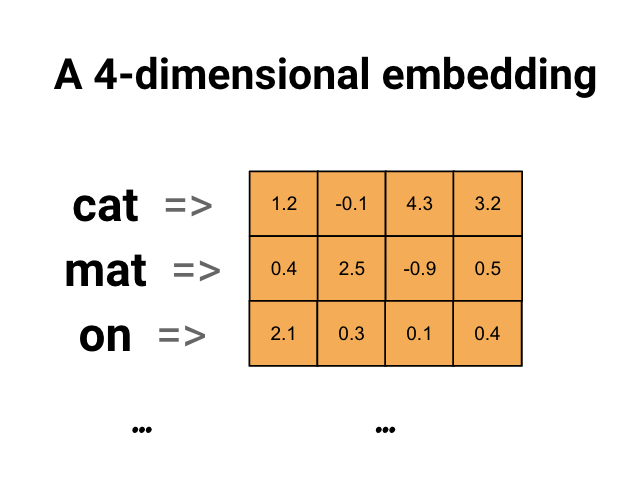

# Semantic Search with tBERT

## Introduction

A traditional [inverted index](https://en.wikipedia.org/wiki/Inverted_index) is a
data structure that maps terms to documents, and thus it can be
used to find documents that contain a term. For example, an inverted index
can be used to find documents that contain the term "cat". It tells us that
the term "cat" appears in documents 1, 2, and 3.

In contrast, Semantic Search uses vector embeddings to map terms to concepts,
and thus it can be used to find documents that are related to a concept.
For example, it can be used to find documents that are related to the
concept of "cat" even if the documents do not contain the term "cat".

## Embeddings

A vector embedding is a vector that represents a concept
according to a language model. For example, the vector embedding
for the concept of "cat" is an array of numbers that represents
the concept of "cat". The vector embedding for the
concept of "cat" is different from the vector embedding for the
concept of "dog". But, they are similar in the sense that they are
both animal.

Let us back up a bit and talk about "vectorizing" text. When working with text,
the first thing you must do is come up with a way to represent the text as
numbers. This is called "vectorizing" text. There are many ways to vectorize
text.

### One-hot encoding

One way is to "one-hot" encode each word in your vocabulary. This means that
you create a vector of zeros that is the same size as your vocabulary, and
then you set the index of the word to 1. For example, consider the sentence
"The cat sat on the mat". You would first create a vocabulary of all the
words in the sentence. In this case, the vocabulary would contain the words
"cat", "mat", "sat", "on", and "the". Then, you would create a vector of
zeros that is the same size as your vocabulary. In this case, the vector
would be of size 5, and you would set the index of the word "cat" to 1.
This is called a "one-hot" vector because only one index is set to 1.


### Encode each word with a unique number

Another way is to encode each word with a unique number.
Continuing the example above, you could assign 1 to "cat", 2 to "mat",
and so on. You could then encode the sentence
"The cat sat on the mat" as a dense vector like [5, 1, 4, 3, 5, 2].
This approach is efficient because it uses less memory than one-hot encoding,
but it does not capture the relationship between words.

### Word embeddings

Word embeddings give us a way to use an efficient vector representation
in which similar words have a similar encoding. An embedding is a vector of
floating point values that are learned by the language model during training.



You can learn more about how embeddings are learned in this
[lecture video](https://developers.google.com/machine-learning/crash-course/embeddings/video-lecture)
from Google.

## Semantic Search

Semantic Search uses vector embeddings to map terms to concepts,
and thus it can be used to find documents that are related to a concept.
For example, it can be used to find documents that are related to the
concept of "cat" even if the documents do not contain the term "cat".

### tBERT
For this to work, we need to have a way to map terms to concepts.
This is where tBERT comes in. tBERT is based on
[bert.cpp](https://github.com/skeskinen/bert.cpp) that does
inference of BERT neural net architecture with pooling and normalization
from SentenceTransformers (https://www.sbert.net/). That means it can only
use models that are based on the
BERT (Bidirectional Encoder Representations for Transformers) architecture.
Furthermore, bert.cpp uses [ggml](https://github.com/ggerganov/ggml) under
the hood, so it can only use models that are supported by ggml.

You can find
some models [here](https://huggingface.co/skeskinen/ggml/tree/main) and you
can download them using the following commands:
```bash
git lfs install
git clone https://huggingface.co/skeskinen/ggml
```
The models vary based on their precision and size. For example, the
`bert-base-uncased/ggml-model-f32.bin` model is 436 MB and has a floating-point
precision of 32 bits. One way to make them smaller is to use quantization.
A quantized model executes some or all of the operations on tensors with
reduced precision rather than full precision (floating point) values.
This allows for a more compact model representation and the use of high
performance vectorized operations on many hardware platforms. For example,
the `bert-base-uncased/ggml-model-q4_0.bin` model is 68.8 MB and has a
quantization precision of 4 bits.

### Indexing

Once you choose the language model to be used, you can index the documents
using the `::tbert::ev` command. This command returns a vector embedding
for the document. You can then store the vector embedding
in PostgreSQL (using [pgvector](https://github.com/pgvector/pgvector)
or [pg_embedding](https://github.com/neondatabase/pg_embedding) extension),
[Solr](https://solr.apache.org/guide/solr/latest/query-guide/dense-vector-search.html),
or [FAISS](https://github.com/facebookresearch/faiss). For the purposes of
this document we will use PostgreSQL (the pg_embedding extension).
Here's how you can create the table:
```sql
CREATE EXTENSION embedding;
create table pgembedding_txt (
        object_id integer,
        embedding real[]
);
```
The following is taken from the `::pgembedding::index` proc of the
OpenACS package
[pgembedding-driver](https://github.com/jerily/openacs-packages/tree/main/pgembedding-driver)
that implements the FtsEngineDriver service contract. Here's how you store
the info computed from `::tbert::ev` in PostgreSQL:
```tcl
    set embedding "\{[join [::tbert::ev mymodel $title] ","]\}"
    db_dml insert_new_embedding_to_index {
        insert into pgembedding_txt (object_id, embedding)
        values(:object_id, :embedding)
    }
```

### Querying

To query, you can use the `::tbert::ev` command to get the vector embedding
for the query, and then you can use the `<->` operator to find the closest
vector embeddings in the index. For example, the following is taken from the
`::pgembedding::search` proc of the OpenACS package
[pgembedding-driver](https://github.com/jerily/openacs-packages/tree/main/pgembedding-driver)
that implements the FtsEngineDriver service contract.
```tcl
    set embedding "ARRAY\[[join [::tbert::ev mymodel $query] ","]\]"
    set result_ids [db_list search_embeddings [subst -nocommands -nobackslashes {
        select object_id
        from pgembedding_txt
        order by embedding <-> $embedding
        limit :limit
    }]]
```

The above orders the results by finding the euclidean distance
between the query vector and the vector embeddings in the index.
The `<->` operator is defined in the pg_embedding extension.

## What it looks like?

We have modified the OpenACS search package to use Semantic Search.
We have populated the database with food hunter reviews and
then searched for the query "I hate this dish". As you see from 
the screenshot full-text search did not return any results, but
Semantic Search returned many results that are related to the query,
in essence, to whether someone liked a dish or not.


## Closing Thoughts

Semantic Search is a powerful tool that can be used to find documents.
It can be used in addition to traditional search methods such as
full-text search (i.e. using inverted index). For example,
you can use vector similarity search to display a "Related Documents"
to the user.

## References

* The images and some text are from this [page](https://www.tensorflow.org/text/guide/word_embeddings).


